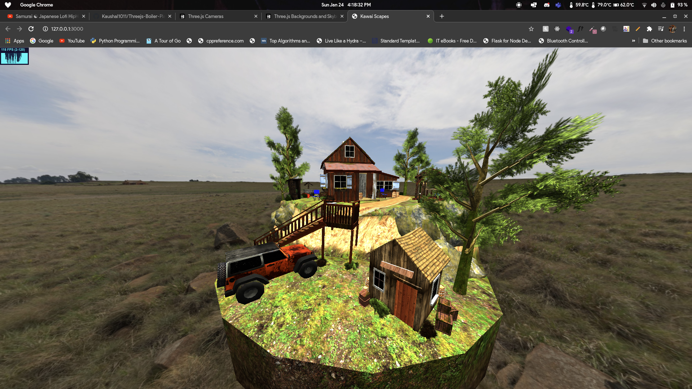

# Threejs-Boiler-Plate

Boiler Plate for starting a Threejs project along tips and learnings that I have learned so far using it.

## How to use

1. `npm i`
2. `npm start` or `npm run dev` (requires you to have nodemon installed `npm install nodemon --save`)
3. serves [index.html](./public/index.html) on **localhost:3000** based on [kawaiscapes.js](./public/js/kawaiscapes.js).

### Docker Instructions

1. `docker build -t kawaiscapes:latest .`
1. `docker run -it --rm -p 3000:3000 kawaiscapes`

## Extra Info

1. **_js_** files are in [JS folder](./public/js/).
1. Assets are in [Assets folder](./public/assets/) and are all almost open source.

## Tips and Tutorials and example info

### Kawai-Scapes

-   Current example code contains how to use gltf loader to load assets.
    > gltf loader is used to load assets that can be downloaded online or can be exported from applications such as blender.
-   Use of two different kinds of light PointLight and Hemisphere light.
    > Light is important in your environment as it influences how your assets/objects look. You can different kinds of lights and of different colors and intensities.
-   How to use OrbitalControls to camera to orbit around an object.
    > There are many kinds of Cameras and you should explore the docs regarding how camera works in Threejs at [Camera Docs](https://threejsfundamentals.org/threejs/lessons/threejs-cameras.html).
-   How to set a sky box background
    > By default the skybox is black which i didnt like so i wanted to set something cool in skybox. There are multiple ways to do this but I used the easiest which was the EquirectangularTexture way. You can find more about this at [Skybox Settings](https://threejsfundamentals.org/threejs/lessons/threejs-backgrounds.html).

## About this & me

I created this because there weren't many Threejs boiler plate and the installation and set up on their website is kind of complex. You can setup three project using this in just 2 steps. Its only an `express` server serving a static `html` page that uses `threejs` js script but maybe in future or with someone's I will build a webpack version with other functionalities as well.

## About Tips, Examples & Tutorials

I have just started to learn threejs! so there can be mistakes and things that I might be doing wrong, if you find something please update or if you're interested in adding examples feel free :D. I hope someday someone can use this in future as quick jump in to threejs or a quick reintroduction. I know there are far more greater tutorials and of good quality but I want to make this in such a way that it is very brief but also contains tips that you would generally come across by experience while coding. Also this helps me keeps track of my progress and if I forget in future iI can just refer here.

## Credits

This work is based on "Forest Diorama" (https://sketchfab.com/3d-models/forest-diorama-a47768b9f834471982d66a747fbaf5b5) by Khadka Niyash (https://sketchfab.com/niyash) licensed under CC-BY-4.0 (http://creativecommons.org/licenses/by/4.0/)
